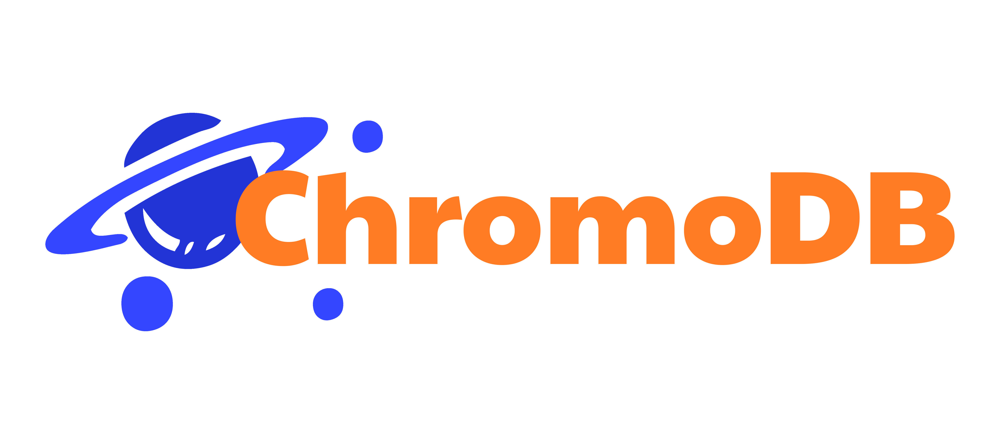

<p align="center">
    
</p>
**************************************

ChromoDB is a disk based key-value store implemented using a Fractal Tree-like data structure. It provides basic operations like inserting, updating, retrieving, and deleting key-value pairs. The database is designed to efficiently handle read and write operations with low latency.

If using networked configuration the default port is 7676 on TCP OR TLS can be changed with --port flag.

## Structure
The database implementation is organized into a many Go packages with the following main components:

- `FractalTree` The central struct representing the database. It includes fields for data and index file handles, as well as the next available offset for storing new data records.

- `OpenFractalTree` A function to open or create a new FractalTree instance. It takes the filenames for the data and index files and returns a FractalTree object.

- `Close` A method to close the FractalTree database, ensuring proper cleanup and closing of file handles.

- `Put` A method to insert or update a key-value pair in the database.

- `Get` A method to retrieve the value associated with a given key.

- `Update` A method to update the value associated with a given key.

- `Delete` A method to delete a key-value pair from the database.

## File Storage
The database stores its data in two separate files:
- `Data File` Contains the actual key-value pairs and their associated metadata.
- `Index File` Maintains an index of keys along with their corresponding offsets in the data file.

## Key-Value Storage Format
The key-value pairs are stored in the data file using the following format:
- `Key Length` 4 bytes (uint32) - Length of the key in bytes.
- `Value Length` 4 bytes (uint32) - Length of the value in bytes.
- `Key` Variable-length byte array - The actual key data.
- `Value` Variable-length byte array - The actual value data.
- `Offset` 8 bytes (int64) - Offset of the next record in the data file.

## Fractal Tree Data Structure
The Fractal Tree is used to efficiently organize and access key-value pairs. It allows for fast lookup, insertion, and deletion operations with a balanced structure, ensuring a predictable and optimal performance.

## Query Parser
Additionally, a queryparser package is provided to interact with the database using simple queries. The QueryParser function accepts a query in the form of a byte slice and performs the corresponding database operation based on the query type (PUT, GET, DEL).

## Commands/Queries

### GET
```
GET->keyname
```

### PUT
```
PUT->keyname->value
```
Key names and values can be of any type.  We store them as a byte array.

If you want to update you just run the put with a different value
```
PUT->keyname->2
```

### DEL
```
DEL->keyname
```

### MEM
```
MEM
```
Shows current database memory usage.


### DISK
```
DISK
```
Shows current database disk usage